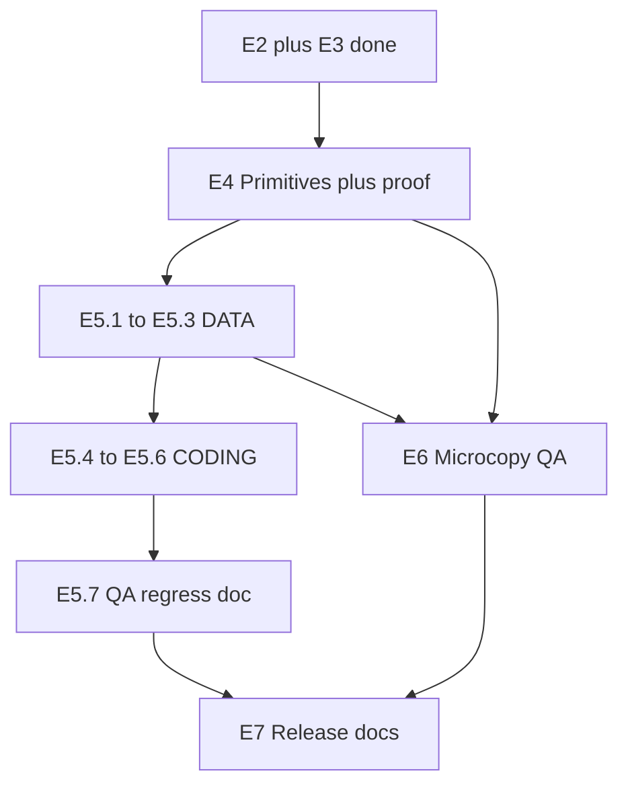

# Design System v0.2 — Vykdymo planas (E4–E7)

> **Paskirtis:** Operacinis planas agentams — iteracijos, failai, exit-kriterijai, kokybės vartai. **Nekeičia** SOT specifikacijos: [`DESIGN_SYSTEM_V0_2.md`](DESIGN_SYSTEM_V0_2.md).
>
> **Statusas:** 2026-05-19. **E1 ✅ · E2 ✅ · E3 ✅ · E4 ✅ · E5 ✅ · E6 ✅ · E7 ✅** (screenshot'ai — rankinis gate)
>
> **Fail-safe:** [`.cursor/rules/design-system-v02.mdc`](../../.cursor/rules/design-system-v02.mdc) — kiekvienoje iteracijoje ≤5 failų diff'e (rule §1).

---

## 0. Progreso santrauka

| Etapas                     | Statusas      | Pastaba                                                   |
| -------------------------- | ------------- | --------------------------------------------------------- |
| E1 Repo audit              | ✅ 2026-05-19 | Chat audito ataskaita                                     |
| E2 Token inventory         | ✅ 2026-05-19 | E2.1–E2.3; baseline 480 findings                          |
| E3 Style inconsistencies   | ✅ 2026-05-19 | E3.1–E3.3; DUPLICATES + @deprecated + Banner `terms`      |
| E4 Component normalization | ✅ 2026-05-19 | Eyebrow, IconChip, SectionDivider + proof + README        |
| E5 Module identity         | ✅ 2026-05-19 | Schema + JSON + ModulesPage / intro / section-break badge |
| E6 Microcopy QA            | ✅ 2026-05-19 | MICROCOPY_LENGTHS + TODO P3 backlog                       |
| E7 Release docs            | ✅ 2026-05-19 | DESIGN_SYSTEM.md, CHANGELOG v0.2.0, E7.4 baseline OK      |

**Sekantis žingsnis:** Release gate — rankiniai screenshot'ai (`DESIGN_SYSTEM_V0_2_VISUAL_DIFF/`, `screenshots/module-identity-2026-05/`).

---

## 1. Kas jau padaryta (E2 + E3) — nuorodos

| Task    | Outputas                                                                                                   |
| ------- | ---------------------------------------------------------------------------------------------------------- |
| DS-E2.1 | `package.json` → `audit:design-tokens`; `scripts/audit-design-tokens.mjs` → `--verbose`                    |
| DS-E2.2 | [`analysis/DESIGN_TOKENS_BASELINE_2026-05.md`](analysis/DESIGN_TOKENS_BASELINE_2026-05.md) — TOTAL **480** |
| DS-E2.3 | [`RELEASE_QA_CHECKLIST.md`](RELEASE_QA_CHECKLIST.md) §8                                                    |
| DS-E3.1 | [`analysis/DESIGN_SYSTEM_DUPLICATES_2026-05.md`](analysis/DESIGN_SYSTEM_DUPLICATES_2026-05.md)             |
| DS-E3.2 | `src/index.css` — 8× `/* @deprecated v0.2 */`                                                              |
| DS-E3.3 | `src/components/ui/Banner.tsx` — variantas `terms`                                                         |

**Regresija:** `npm run audit:design-tokens` — TOTAL ≤ **480** (hex ≤ 351, inline ≤ 13, svg ≤ 116).

---

## 2. Modulio identitetas (E5) — fiksuoti duomenys

Šaltinis: `DESIGN_SYSTEM_V0_2.md` §1. **Tik M1–M6.** M7–M15 — laukai optional, be reikšmių.

| Modulis | `accent`  | `identityIcon` (lucide) |
| ------- | --------- | ----------------------- |
| M1      | `brand`   | `BookOpen`              |
| M2      | `slate`   | `ClipboardList`         |
| M3      | `emerald` | `Briefcase`             |
| M4      | `violet`  | `Brain`                 |
| M5      | `cyan`    | `ClipboardCheck`        |
| M6      | `accent`  | `Rocket`                |

**Taikymo vietos (TIK 3):** ModulesPage top stripe · ActionIntroSlide eyebrow · SectionBreakSlide section badge. **NE:** diagramos, CTA, body, callout'ai (rule §4–§5).

---

## 3. Vykdymo srautas (E4 → E5 → E6 ‖ E5 → E7)



---

## 4. Etapas E4 — Component normalization

**Tikslas:** 3 primitivai + smoke testai + ≥1 realus panaudojimas kiekvienam. **NE** masinė migracija.

### Iteracija A — Eyebrow + IconChip (4 failai)

| Task    | Agentas | Failai                                                                            | Exit                                                                                                 |
| ------- | ------- | --------------------------------------------------------------------------------- | ---------------------------------------------------------------------------------------------------- |
| DS-E4.1 | CODING  | `src/components/ui/Eyebrow.tsx`, `src/components/ui/__tests__/Eyebrow.test.tsx`   | 6 accent (`brand`, `accent`, `slate`, `emerald`, `violet`, `cyan`); smoke: render + `role` / tekstas |
| DS-E4.2 | CODING  | `src/components/ui/IconChip.tsx`, `src/components/ui/__tests__/IconChip.test.tsx` | 5 role (`cta`, `info`, `warn`, `success`, `error`); 3 dydžiai sm/md/lg (28/36/44px)                  |

**Eyebrow API (etalonas):**

```tsx
<Eyebrow icon={BookOpen} accent="brand">
  Modulis 1 · Mokymas
</Eyebrow>
```

**IconChip API:**

```tsx
<IconChip icon={Briefcase} role="info" size="md" />
```

**Gate:** `npm run lint`, `typecheck`, `test:run`, `audit:design-tokens` (≤480).

### Iteracija B — SectionDivider (2 failai)

| Task    | Agentas | Failai                                                                                        | Exit                                  |
| ------- | ------- | --------------------------------------------------------------------------------------------- | ------------------------------------- |
| DS-E4.3 | CODING  | `src/components/ui/SectionDivider.tsx`, `src/components/ui/__tests__/SectionDivider.test.tsx` | Su/be `label`; accent default `brand` |

**Gate:** tas pats kaip Iter A.

### Iteracija C — Proof of usage + katalogas (≤5 failų)

| Task     | Agentas        | Failai                                                      | Pakeitimas                                                |
| -------- | -------------- | ----------------------------------------------------------- | --------------------------------------------------------- |
| DS-E4.4a | UI_UX + CODING | `ModulesPage.tsx`                                           | `<Eyebrow>` kortelės badge vietoje (optional, mažas diff) |
| DS-E4.4b | CODING         | `ModuleCompleteScreen.tsx` arba `Banner.tsx`                | `<IconChip>` vienas panaudojimas                          |
| DS-E4.4c | CODING         | `ContentSlides.tsx` (`SummarySlide`)                        | `<SectionDivider label="…" />` tarp blokų                 |
| DS-E4.5  | QA             | `src/components/ui/index.ts`, `src/components/ui/README.md` | 9 export'ų (6 seni + 3 nauji); README 9 sekcijos          |

**Pastaba E4.4:** Jei `ModulesPage` diff per didelis — Eyebrow proof gali būti `ActionIntroSlide` (bet tada priklauso nuo E5 wiring; preferuoti ModulesPage badge eilutę ~349–363).

**E4 exit (etapas):** 3 primitive'ai, kiekvienas ≥1 naudotojas; `index.ts` atnaujintas; testai praeina.

---

## 5. Etapas E5 — Module identity layer

**Priklausomybė:** E4.1 (Eyebrow) baigtas prieš E5.5.

### Iteracija D — DATA (4–5 failų)

| Task    | Agentas | Failai                                                                                                |
| ------- | ------- | ----------------------------------------------------------------------------------------------------- |
| DS-E5.1 | DATA    | `scripts/schemas/modules.schema.json` — optional `accent` enum, `identityIcon` string + `description` |
| DS-E5.2 | DATA    | `src/data/modules.json` — M1–M6 laukai pagal §2 lentelę                                               |
| DS-E5.3 | DATA    | `src/data/modules-en.json`, `src/data/modules-m1-m6.json` — sinchronas                                |
| —       | CODING  | `src/types/modules.ts` — `Module` interface: optional `accent?`, `identityIcon?`                      |

**Gate:** `npm run validate:schema` OK.

### Iteracija E — UI (3–4 failai, seka)

| Task    | Agentas        | Failas                                     | Techninis pastebėjimas                                                                                                                                                                                                                                                        |
| ------- | -------------- | ------------------------------------------ | ----------------------------------------------------------------------------------------------------------------------------------------------------------------------------------------------------------------------------------------------------------------------------- |
| DS-E5.4 | CODING + UI_UX | `ModulesPage.tsx`                          | Top bar `h-1.5`: jei `module.accent` → `bg-{accent}-500`, kitaip `styles.gradient`. `practice` level → emerald diferenciacija (LHF #5).                                                                                                                                       |
| DS-E5.5 | CODING         | `ActionIntroSlide.tsx`, `SlideContent.tsx` | Šiandien `ActionIntroSlide` gauna tik `{ content }`. **Wire:** per `SlideContent` `ctx.moduleId` + modulio lookup (`getModulesSync`) → `accent` + `identityIcon` → `<Eyebrow>` virš hero (ne hero viduje H1 gradient — atskira eilutė virš `whyBenefit`).                     |
| DS-E5.6 | CODING         | `ContentSlides.tsx`                        | `sectionBreakColorMap` papildyti `slate`, `cyan`, `accent` (badge klasės). Badge `sectionNumber` naudoja `module.accent` iš props/context. **Hero / spinoff / recap — NEKEISTI** (`heroColorKey` lieka). Wire per `SlideContent` → `LazySectionBreakSlide` su `moduleAccent`. |

**Lucide mapping (E5.5):** `Record<string, LucideIcon>` — `BookOpen`, `ClipboardList`, `Briefcase`, `Brain`, `ClipboardCheck`, `Rocket` (jau importuojami `ModulesPage.tsx`).

**Gate:** lint, typecheck, test, build, audit ≤480.

### Iteracija F — QA dokumentas (1 failas)

| Task    | Agentas | Outputas                                                                                                                                             |
| ------- | ------- | ---------------------------------------------------------------------------------------------------------------------------------------------------- |
| DS-E5.7 | QA      | `docs/development/analysis/MODULE_IDENTITY_VISUAL_REGRESS_2026-05.md` — 12 screenshot'ų (6 moduliai × ModulesPage + intro); WCAG AA; rule §5 patikra |

---

## 6. Etapas E6 — Microcopy QA (paraleliai su E5)

| Task    | Outputas                                          |
| ------- | ------------------------------------------------- |
| DS-E6.1 | `MICROCOPY_LENGTHS_2026-05.md` — footer >55 simb. |
| DS-E6.2 | M1/M4/M6 sąrašai (read-only, be JSON keitimo)     |
| DS-E6.3 | `TODO.md` P3 — viena eilutė microcopy backlog     |

---

## 7. Etapas E7 — Release

| Task    | Outputas                                                                                                |
| ------- | ------------------------------------------------------------------------------------------------------- |
| DS-E7.1 | `DESIGN_SYSTEM_V0_2_VISUAL_DIFF/` — 8 PNG                                                               |
| DS-E7.2 | `DESIGN_SYSTEM.md` skeletas (10 skyrių, 2 pilni)                                                        |
| DS-E7.3 | `CHANGELOG.md` `## [v0.2.0]` (pilnas release įrašas; dabartinis `[Unreleased]` E2/E3 lieka iki release) |
| DS-E7.4 | `npm run audit:design-tokens` — TOTAL ≤ 480 vs baseline                                                 |

---

## 8. Kokybės vartai (kiekvienai iteracijai)

```bash
npm run lint
npm run typecheck
npm run test:run
npm run build
npm run audit:design-tokens    # TOTAL <= 480
npm run validate:schema        # po DATA pakeitimų
```

---

## 9. Rizikos (trumpai)

| Rizika                                           | Mitigacija                                                     |
| ------------------------------------------------ | -------------------------------------------------------------- |
| E5.5/E5.6 reikia `SlideContent` wiring           | `ctx.moduleId` jau yra; lookup modulio iš loader               |
| `sectionBreakColorMap` tik 3 spalvos             | Pridėti `slate`, `cyan`, `accent` badge eilutėms               |
| E4.4 + E5.5 abu liečia intro                     | E4 proof → ModulesPage; E5.5 → ActionIntroSlide                |
| Audit TOTAL padidėja po E5                       | Tik Tailwind utility klasės, ne hex; jei ↑ — paaiškinimas E7.4 |
| `<Card />` / `<CTAButton />` vis dar 0 naudotojų | v0.3 migracija; v0.2 tik @deprecated + primitive'ai            |

---

## 10. Nuorodos

| Kas             | Kur                                                                                            |
| --------------- | ---------------------------------------------------------------------------------------------- |
| SOT planas      | [`DESIGN_SYSTEM_V0_2.md`](DESIGN_SYSTEM_V0_2.md)                                               |
| Token baseline  | [`analysis/DESIGN_TOKENS_BASELINE_2026-05.md`](analysis/DESIGN_TOKENS_BASELINE_2026-05.md)     |
| Dublikatai      | [`analysis/DESIGN_SYSTEM_DUPLICATES_2026-05.md`](analysis/DESIGN_SYSTEM_DUPLICATES_2026-05.md) |
| Release QA §8   | [`RELEASE_QA_CHECKLIST.md`](RELEASE_QA_CHECKLIST.md)                                           |
| TODO sinchronas | [`TODO.md`](../../TODO.md) — skyrius „P1 — Design System v0.2“                                 |
| Golden standard | [`GOLDEN_STANDARD.md`](GOLDEN_STANDARD.md)                                                     |

---

_Atnaujinti šį failą po kiekvieno etapo (E4, E5, …) — statuso lentelė §0._
