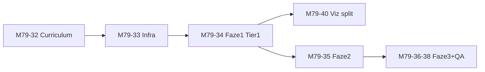

# M7 Lygis C — pilnai adaptuotas branduolys (6 promptų rinkiniai)

> **Epic:** M79-32 … M79-40  
> **Backlog:** `docs/development/07_08_09_backlog.md` §P0  
> **SOT grandinė:** `turinio_pletra_moduliai_7_8_9.md` → `modules.json` (bazė) → `modules-journey-m7.json` (overlay) → UI resolver  
> **Statusas:** RC-1 įgyvendinta 2026-07-15 (M79-32–34); RC-2+ planuojama

---

## 1. Tikslas

6 atskiri **branduolio** promptų rinkiniai pagal skaidrės 70 `journeyChoices.id`, kad kiekvienas kelias pedagogiškai jaustųsi kaip atskira trajektorija — ne tik paslėptos `pathBranch` šakos.

**Neįeina į šio epic scope (sąmoningai):**

- Warm-up quiz (73.5, 731.5, 891.5, 68.5, 74.5) — **6× klausimų nereikia**; pakanka Tier 1–2 `copyable` adaptacijos.
- Teminių šakų (`viz`, `technika`, `strategija`, `etika-plus`) pilnas perrašymas — atskiras darbas, išskyrus **M79-40** (viz split).

---

## 2. Patvirtinti sprendimai (savininkas 2026-07-15)

| #   | Klausimas                                     | Sprendimas                                                                                     |
| --- | --------------------------------------------- | ---------------------------------------------------------------------------------------------- |
| 1   | **Fallback**, jei trūksta varianto            | Rodyti **bendrinį pardavimų tekstą** — t. y. `modules.json` bazė / overlay laukas `pardavimai` |
| 2   | **M79-40** (Pardavimai ≠ Rinkodara viz split) | **Įeina į tą patį epic**; **atskiras release po Lygio C Faze 1** (po M79-34)                   |
| 3   | **Warm-up 6×**                                | **Ne** — pakanka Tier 1–2 `copyable` (+ mikrocopy kur reikia)                                  |

### Fallback resolver logika (privaloma implementacijai)

```
resolveCopyable(path, activeJourneyId):
  1. overlay[path][activeJourneyId]  // jei yra
  2. overlay[path]['pardavimai']     // jei yra
  3. modules.json bazinis copyable   // dabartinis SOT (pardavimų orientuotas)
```

**Kodėl `pardavimai`, ne `kita`:** bazinis `modules.json` turinys jau naudoja pardavimų/Q3/e-commerce pavyzdžius; fallback turi būti stabilus ir ne silpnesnis už dabartinį default.

---

## 3. Šešių kelių signature (North Star)

| `journeyId`     | Signature (1 sakinys)                                 | Pagrindinis OUTPUT                |
| --------------- | ----------------------------------------------------- | --------------------------------- |
| `pardavimai`    | DI padeda skaičiuoti pardavimus ir prognozuoti        | KPI + tendencija + forecast       |
| `rinkodara`     | DI padeda suprasti kanalus, turinį ir reakcijas       | Sentimentas + kanalai + kampanija |
| `it-inzinerija` | DI padeda tvarkyti duomenis ir automatizuoti pipeline | Schema + valymas + ETL            |
| `personalas`    | DI padeda analizuoti žmones, ne tik skaičius          | Funnel + retention + pulse        |
| `vadyba`        | DI padeda priimti sprendimą su patikimu pagrindu      | Executive summary + rizika        |
| `kita`          | DI padeda su bet kokiais vidiniais duomenimis         | Universalūs `[X]` šablonai        |

---

## 4. Adaptacijos matrica (max ROI)

### Tier 1 — Faze 1 (M79-34) ~108 turinio vienetų

| Skaidrė | Ką variuoti 6×                           | Promptų ~ |
| ------- | ---------------------------------------- | --------- |
| **731** | 4 analizės tipų `copyable` + `Kam tai?`  | 24        |
| **733** | 3 šablonų `copyable` (rolės specifiniai) | 18        |
| **74**  | MASTER `CONTEXT` / `AUDIENCE`            | 6         |
| **734** | 4 sprendimų filtrų promptai              | 24        |
| **75**  | Refleksija + 48h veiksmas                | 6         |

**Tikslas:** ~70 % jaučiamo individualumo.

### Tier 2 — Faze 2 (M79-35) ~138 turinio vienetų

| Skaidrės                                           | `copyable` laukai                                            |
| -------------------------------------------------- | ------------------------------------------------------------ |
| 73, 732, 78, 78.5, 83, 84, 86, 87, 89, 891, 90, 92 | Pipeline, sentimentas, DB, viz, prognozė, šaltiniai, EDA, BI |

### Tier 3 — Faze 3 (M79-36, 37)

- Path-step 71.1–71.5 (5×6)
- EN overlay 6× (`audit:m79`)
- **Ne:** warm-up 6×

### M79-40 — Release po Faze 1

- `viz` → `viz-sales` / `viz-mkt` (bent 2–3 unikalios skaidrės)
- Pardavimai: executive KPI dashboard; Rinkodara: kanalų/storytelling
- Vykdoma **po M79-34**, toje pačioje epic sekoje, atskiras deploy/commit batch

---

## 5. Techninė architektūra

### Duomenų sluoksnis (Architecture A)

| Failas                                | Paskirtis                                                                            |
| ------------------------------------- | ------------------------------------------------------------------------------------ |
| `src/data/modules.json`               | Bazė + fallback (`pardavimai` semantika)                                             |
| `src/data/modules-journey-m7.json`    | **Naujas** partial overlay: `slideId` → `fieldPath` → `{ pardavimai, rinkodara, … }` |
| `src/data/modules-journey-en-m7.json` | EN overlay (Faze 3)                                                                  |

### Kodas

| Failas                                        | Paskirtis                     |
| --------------------------------------------- | ----------------------------- |
| `src/utils/resolveJourneyCopy.ts`             | Fallback grandinė §2          |
| `SlideContent.tsx` / `ContentSlides.tsx`      | Merge prieš CopyButton render |
| `scripts/schemas/modules-journey.schema.json` | Validacija                    |
| `scripts/audit-m7-journey-coverage.mjs`       | Tier 1–2 coverage gate        |

### Invariantai

- M8 `relatedSlideId` (73, 74, 86, 92, 731, 732, 733, 891) — **negali** gauti `pathBranch`.
- `journeyId` ∈ `moduleJourneyFocus.ts` 6 id.
- Kiekvienas Tier 1 overlay laukas turi **6** raktus arba aiškiai naudoja fallback.

---

## 6. Release seka (vienas epic, kelios bangos)



| Release  | Backlog                | Turinys                          |
| -------- | ---------------------- | -------------------------------- |
| **RC-1** | M79-32, M79-33, M79-34 | Spec + resolver + Tier 1 inkarai |
| **RC-2** | M79-40                 | Pardavimai ≠ Rinkodara viz       |
| **RC-3** | M79-35                 | Tier 2 operaciniai               |
| **RC-4** | M79-36–39              | Path-step, EN, audit, smoke      |

---

## 7. Pipeline

```
CURRICULUM (M79-32) → CONTENT (M79-34/35/36) → DATA (overlay JSON)
  → CODING (M79-33) → CODE_REVIEW → QA (M79-38, audit:m79, audit:m7-journey-coverage)
```

---

## 8. DoD (epic uždarymas)

- [x] `modules-journey-m7.json` Tier 1–2 + path-step (6×; RC-4: 1 primary field / likusią skaidrę)
- [x] Resolver unit testai: missing variant → pardavimai → base (+ path-step)
- [x] M79-40 viz split deploy'intas (LT+EN, 2026-07-16)
- [x] Overlay `sections[]` indeksai sutampa su `modules.json` copyable (74/733/734/78 pataisyta 2026-07-16); `audit:m7-journey-indices`
- [x] `audit:m7-journey-coverage` PASS (31 fields × 6)
- [x] `audit:m79` PASS (po EN)
- [x] USER_JOURNEY smoke: 6 keliai — „ar jaučiasi mano rolė?“ (M79-39) — TEST_REPORT (browser re-smoke prieš release)
- [x] CHANGELOG + `07_08_09_backlog.md` statusai `atlikta`

---

## Nuorodos

- `docs/MODULIO_7_SKAIDRIU_EILES.md` — branduolys 36, šakos
- `docs/development/07_08_09_backlog.md` — §P0 backlog
- `src/utils/moduleJourneyFocus.ts` — 6 choice ids
